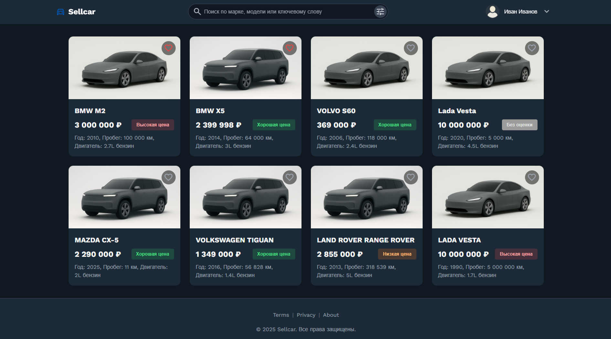
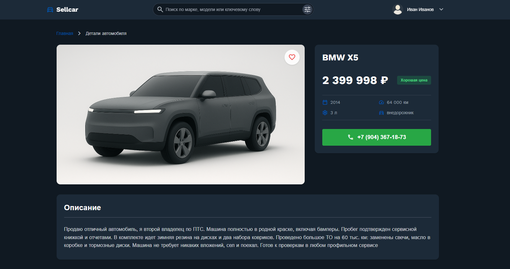
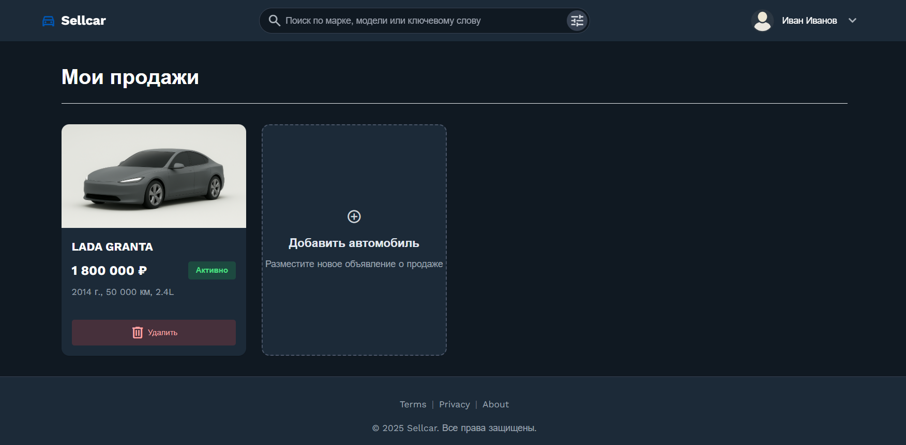
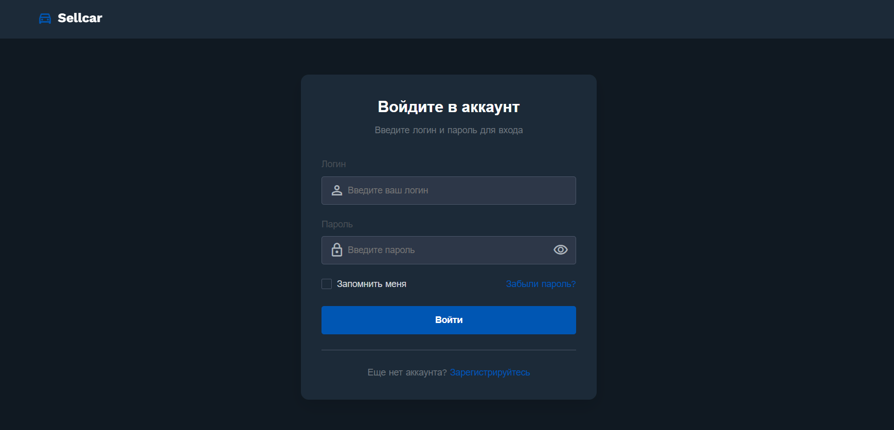

# SellCar-Platform 

**SellCar** - полнофункциональный веб-сервис для купли-продажи автомобилей с интегрированными ML-решениями, который объединяет современный backend на FastAPI и алгоритмы машинного обучения для автоматической оценки стоимости и формирования персональных рекомендаций.

---

## Интерфейс приложения

Разработан адаптивный интерфейс. Ниже представлены ключевые экраны платформы:

| Главная страница (Каталог) | Карточка автомобиля |
|:---:|:---:|
|  |  |
| *Интеллектуальный поиск и фильтрация* | *Подробные характеристики и рекомендации* |

| Управление объявлениями | Авторизация |
|:---:|:---:|
|  |  |
| *Просмотр и редактирование своих лотов* | *Безопасный вход через JWT* |

---

## Технологический стек
- **Backend:** Python 3.10+, FastAPI, SQLAlchemy (ORM)
- **Data Science:** Scikit-learn, Pandas, CatBoost
- **Database:** SQLite
- **DevOps:** Docker, Docker Compose
- **Frontend:** HTML5, CSS3, JavaScript

---

## Основные возможности
* **ML-прогнозирование и аналитическая оценка стоимости**:
    * В систему интегрирована ML-модель **CatBoost**, которая на основе технических характеристик прогнозирует рыночную стоимость автомобиля. На основе предсказания модели программная логика проводит сегментацию объявления, сравнивая «справедливую» цену с ценой, указанной продавцом. Это позволяет автоматически классифицировать сделки как **«Низкая»**, **«Высокая»** или **«Хорошая»** цена, предоставляя пользователю мгновенную аналитику по каждому лоту.

* **Персонализированный рекомендательный движок**:
    * Рекомендательная система подбора автомобилей в зависимости от предпочтений пользователя, основанная на **векторизации признаков авто** и вычислении **косинусного сходства (Cosine Similarity)** между объектами.
    * Это обеспечивает высокую релевантность рекомендаций, опираясь на историю просмотров и взаимодействий пользователя.

* **Личный кабинет и управление контентом**:
    * Полноценное рабочее пространство пользователя: создание и редактирование объявлений, вкладка «Избранное» и хранение истории активности для настройки рекомендаций.
      
* **Контекстная система отображения превью**:
   * При отсутствии пользовательских фото в карточках авто система выполняет подстановку заготовленных графических ассетов на основе типа кузова (седан, внедорожник и др.), обеспечивая консистентность интерфейса. Для неопределенных категорий предусмотрен универсальный плейсхолдер.

* **Безопасность и аутентификация**:
    * Защита данных реализована через **JWT-токены** (JSON Web Tokens). 
    * Для обеспечения безопасности учетных записей используется современный стандарт хэширования паролей **Argon2**, что исключает хранение данных в открытом виде и обеспечивает устойчивость к brute-force атакам.
      
---

## Инструкция по запуску
 
Вы можете запустить проект двумя способами: через Docker (для быстрой проверки в изолированной среде) или локально.
 
### Вариант 1: Запуск через Docker 
Этот способ автоматически настроит сервер, базу данных и всё необходимое окружение. Вам нужен только установленный **Docker Desktop**.
 
1. **Клонируйте репозиторий и перейдите в папку:**
   ```bash
   git clone https://github.com/ваш_логин/SellCar-Platform.git
   cd SellCar-Platform
   ```
 
2. **Запустите контейнеры:**
   ```bash
   docker compose up --build
   ```
 
3. **Проверьте работу:**
   - **Сайт:** [http://localhost](http://localhost) (доступен на порту 80)
   - **Панель управления БД (Adminer):** [http://localhost:8081](http://localhost:8081)
 
---
 
### Вариант 2: Локальный запуск (Python)
В проекте подготовлен скрипт для автоматизации всех этапов настройки.
 
1. **Запустите скрипт инициализации (Windows):**
   Откройте терминал в папке проекта и выполните:
   ```powershell
   ./run.ps1
   ```
   *Скрипт автоматически создаст виртуальное окружение, установит зависимости из requirements.txt` и запустит сервер.*
 
2. **Если вы запускаете вручную (универсальный способ):**
   ```bash
   python -m venv venv
   # Активация (Windows): .\venv\Scripts\activate
   # Активация (Linux/macOS): source venv/bin/activate
   pip install -r requirements.txt
   uvicorn main:app --reload
   ```

3. **Проверьте работу:**
   - **Сайт:** [http://127.0.0.1:8000](http://127.0.0.1:8000)

## Тестовый доступ
Чтобы протестировать функции личного кабинета и персонализированных рекомендаций, можете создать собственный аккаунт или воспользуйться демонстрационным:
* **Логин:** `avarage_user`
* **Пароль:** `regular_pass`

---

## Структура проекта

Ниже представлено описание ключевых файлов и папок проекта:

* **`main.py`** — Основной файл приложения (FastAPI). Содержит маршруты (endpoints), логику обработки запросов и интеграцию всех модулей.
* **`models.py`** — Описание моделей данных SQLAlchemy. Определяет структуру таблиц базы данных (пользователи, объявления, избранное).
* **`auth.py`** — Модуль безопасности. Содержит логику JWT-авторизации, валидации токенов и хэширования паролей (Argon2).
* **`price_model.py`** — Интеграция ML-модели. Отвечает за загрузку весов CatBoost, обработку входных данных и расчет прогнозируемой стоимости.
* **`car_recommendation.py`** — Сервис рекомендаций. Реализует векторизацию признаков и расчет косинусного сходства для подбора похожих авто.
* **`database/`** — Директория с файлом базы данных SQLite (`cars_database.db`).
* **`static/`** — Фронтенд-часть проекта: HTML-шаблоны, CSS-стили и клиентские JavaScript-скрипты.
* **`catboost_mixed_features.pkl`** — Скомпилированная и обученная модель машинного обучения.
* **`docker-compose.yml` & `Dockerfile`** — Конфигурационные файлы для контейнеризации и развертывания проекта.
* **`run.ps1`** — Скрипт автоматизации для быстрого локального запуска в среде Windows/PowerShell.
* **`requirements.txt`** — Перечень всех необходимых Python-зависимостей проекта.
